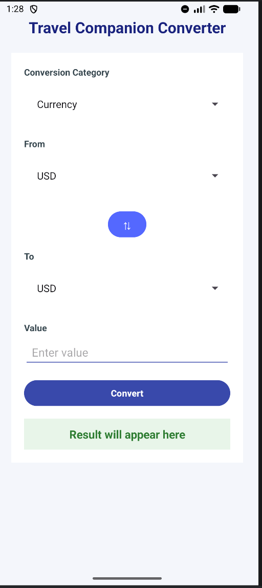
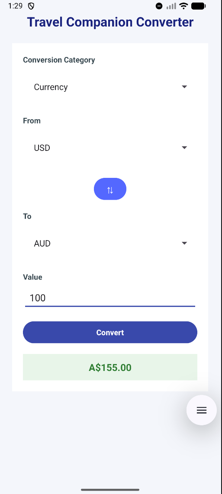
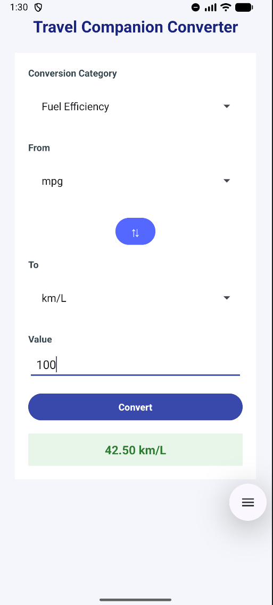
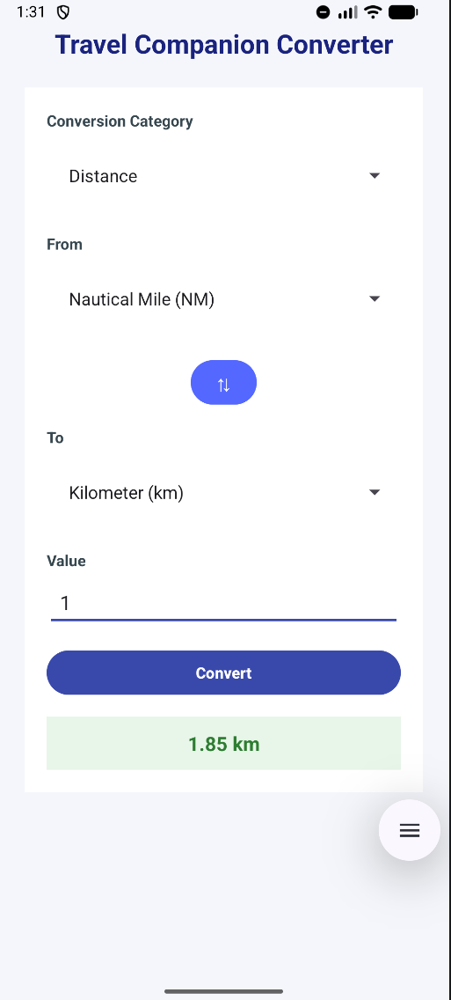
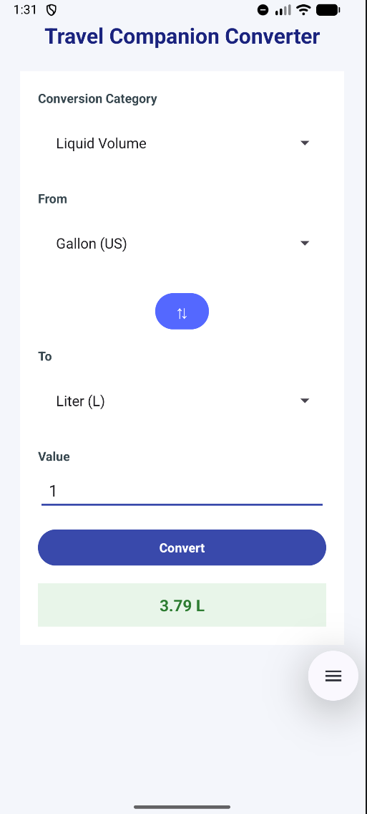
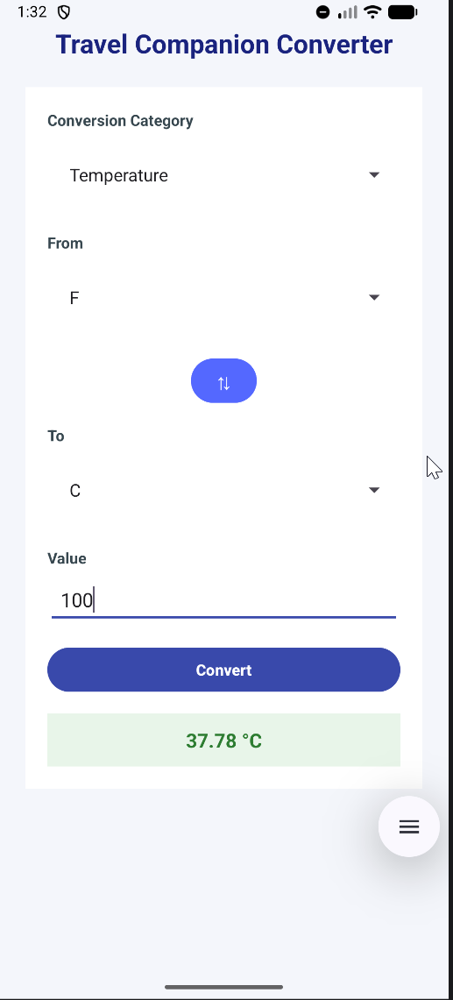

SIT305 – Task 2.1P
Travel Companion Converter

Features:
- Currency conversion
- Fuel efficiency conversion
- Distance conversion (NM ↔ km)
- Liquid volume conversion
- Temperature conversion

The application was designed and tested in Android Studio and verified
to build successfully when cloned from the GitHub repository.

The 2.1P requirements only required basic conversion functionality, 
however, additional improvements were implemented to improve usability
and robustness of the app such as:

- Input validation to prevent empty or invalid numeric entries
- Protection against negative values for non-temperature conversions
- Unit swap button allowing quick reversal of conversion direction (my design favorite lol)
- Improved UI spacing and touch targets for mobile usability

These additions were implemented to improve UI/UX and
practice more robust app behaviour beyond minimum
assignment requirements.

## Screenshots

| | | |
|---|---|---|
|  |  |  |
| **Home** | **Currency** | **Fuel** |
|  |  |  |
| **Distance** | **Liquid** | **Temperature** |
